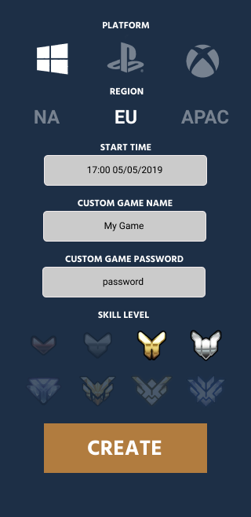
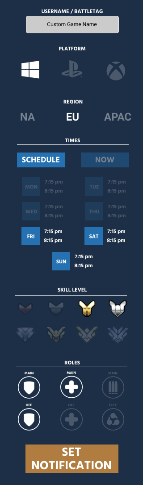

# Overview

Web App to help organise Pick Up Games for Overwatch. When the matchmaker has placed your with 5 DPS and you can't take it anymore - leave out the algorithm.

## Features

### Schedule a game

Define what your pick up game will be 
- Platform
- Region
- Start Time
- Custom game Name/Password
- Skill Level

### Find Pick Up Games

Define what games you are looking for
- Platform
- Region
- Skill Level
- Roles you can play

:construction: Possible feature - set notifications for games

# Change Log
  - [2019-05-13] Initial Framework setup

# Usage

## Environment Requirements
- Nodejs / npm

## Install
- Clone Repository
- run ``npm install`` from terminal
- run ``npm start`` from terminal

## Running tests
- You must have geckodriver installed and running
  - follow the "download geckodriver" section in [this link](https://webdriver.io/docs/gettingstarted.html#download-geckodriver)
- from the project root in the command line (windows) run `"node_modules/.bin/wdio.cmd" wdio.conf.js`